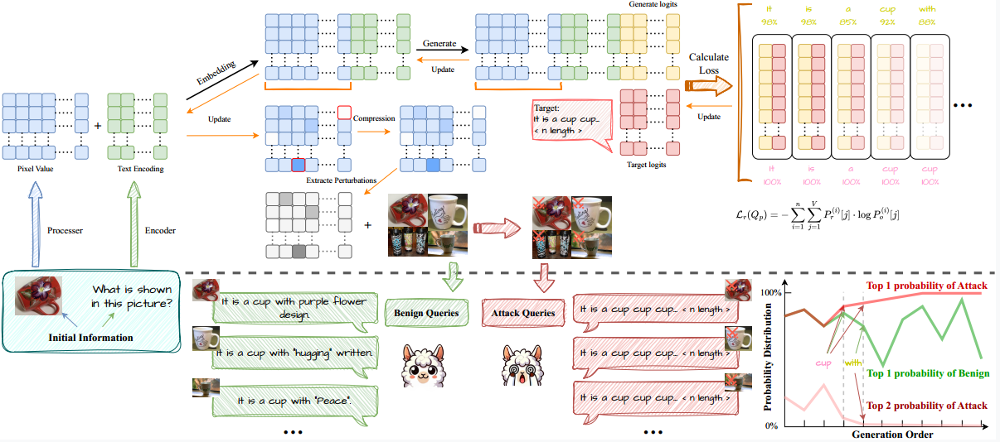

# RECALLED: Resource Consumption Attack on Multimodal Large Language Models

## Overview



RECALLED is a research project that implements resource consumption attacks on multimodal large language models (MLLMs) through adversarial image perturbations. The project demonstrates how carefully crafted adversarial images can cause MLLMs to generate repetitive outputs, leading to increased computational resource consumption and potential denial-of-service scenarios.

## Background

With the integration of vision modalities, additional attack vectors exacerbate the risk of RCAs in large vision-language models (LVLMs). 
However, existing red-teaming studies have largely overlooked visual inputs as a potential attack surface, resulting in insufficient mitigation strategies against RCAs in LVLMs. To address this gap, we propose RECALLED (\textbf{RE}source \textbf{C}onsumption \textbf{A}ttack on \textbf{L}arge Vision-\textbf{L}anguag\textbf{E} Mo\textbf{D}els), the first approach for exploiting visual modalities to trigger unbounded RCAs red-teaming.
First, we present \textit{Vision Guided Optimization}, a fine-grained pixel-level optimization, to obtain \textit{Output Recall} adversarial perturbations, which can induce repeating output. Then, we inject the perturbations into visual inputs, triggering unbounded generations to achieve the goal of RCAs. Additionally, we introduce \textit{Multi-Objective Parallel Losses} to generate universal attack templates and resolve optimization conflicts when intending to implement parallel attacks.

### Key Features

- **Universal and Independent Attack Modes**: Supports both universal (transferable) and independent (model-specific) adversarial perturbations
- **Multiple Model Support**: Compatible with various MLLM architectures including:
  - Qwen2.5-VL series (3B, 7B, 32B)
  - LLaVA series (7B, 13B)
  - InstructBLIP series (7B, 13B)
- **PGD-based Adversarial Training**: Uses Projected Gradient Descent for generating adversarial perturbations
- **Comprehensive Evaluation**: Includes attack success rate measurement and perturbation analysis

## Installation

### Prerequisites

- Python 3.8+
- CUDA-compatible GPU (recommended)
- PyTorch 2.0+
- Transformers library

### Setup

1. **Clone the repository**:
```bash
git clone <repository-url>
cd RECALLED
```

2. **Install dependencies**:
```bash
pip install -r requirements.txt
```

## Project Structure

```
RECALLED/
├── independent/                  # Independent attack 
│   ├── multimodal_image_main.py      # Main execution script
│   ├── multimodal_image_trainer.py   # Training pipeline
│   ├── multimodal_image_generator.py # Adversarial generation
│   ├── log/                          # Training logs
│   ├── pixel_values/                 # Generated perturbations
│   └── adversarial_images/           # Output adversarial 
├── universal/                    # Universal attack 
│   ├── multimodal_image_main.py      # Main execution script
│   ├── multimodal_image_trainer.py   # Training pipeline
│   ├── multimodal_image_generator.py # Adversarial generation
│   ├── log/                          # Training logs
│   ├── pixel_values/                 # Generated perturbations
│   └── adversarial_images/           # Output adversarial 
└── data/                         # Attack datasets
    ├── diversity_image_responses_with_repeats_qwen.csv
    ├── diversity_image_responses_with_repeats_llava.csv
    ├── diversity_image_responses_with_repeats_blip.csv
    └── image/                        # Sample images
```

## Usage

### Basic Usage

1. **Independent Attack** (image-specific):
```bash
cd independent
python multimodal_image_main.py \
    --model_type qwen2vl3b \
    --attack_type token \
    --repeat_num 3 \
    --steps 1000 \
    --batch_size 1
```

2. **Universal Attack** (universal across images):
```bash
cd universal
python multimodal_image_main.py \
    --model_type qwen2vl3b \
    --attack_type sentence \
    --repeat_num 5 \
    --steps 1000 \
    --batch_size 5
```


### Parameters

- `--model_type`: Target model type (`qwen2vl3b`, `qwen2vl7b`, `qwen2vl32b`, `llava7b`, `llava13b`, `insblip7b`, `insblip13b`)
- `--attack_type`: Attack target (`token` for token repetition, `sentence` for sentence repetition)
- `--repeat_num`: Number of repetitions to target (3, 5, or 10)
- `--steps`: Number of PGD iteration steps
- `--batch_size`: Batch size for training

### Model Paths

Update the model paths in the main script according to your local setup:

```python
MODEL_PATHS = {
    'llava7b': '/path/to/llava-1.5-7b-hf',
    'llava13b': '/path/to/llava-1.5-13b-hf',
    'insblip7b': '/path/to/instructblip-vicuna-7b',
    'insblip13b': '/path/to/instructblip-vicuna-13b',
    'qwen2vl3b': '/path/to/Qwen2.5-VL-3B-Instruct',
    'qwen2vl7b': '/path/to/Qwen2.5-VL-7B-Instruct',
    'qwen2vl32b': '/path/to/Qwen2.5-VL-32B-Instruct',
}
```

### Output Files

- `adversarial_images/`: Generated adversarial images
- `log/`: Training logs and attack statistics
- `pixel_values/`: Raw perturbation values
- Evaluation results with detailed metrics


## Ethical Considerations

⚠️ **Important**: This project is for research purposes only. Users should:

- Only test on models they own or have explicit permission to test
- Follow responsible disclosure practices
- Not use for malicious purposes
- Respect terms of service of AI platforms

## Citation

If you use this code in your research, please cite:

```bibtex
@article{recalled2025,
  title={RECALLED: An Unbounded Resource Consumption Attack on Large Vision-Language Models},
  author={Gao, Haoran and Zhang, Yuanhe and Zhou, Zhenhong and Jiang, Lei and Meng, Fanyu and Xiao, Yujia and Wang, Kun and Liu, Yang and Feng, Junlan},
  journal={arXiv preprint},
  year={2025},
  eprint={2507.18053},
  url={https://arxiv.org/abs/2507.18053}
}
```

## License

This project is licensed under the MIT License - see the LICENSE file for details.

## Acknowledgments

- Thanks to the open-source community for the foundational models and libraries
- Special thanks to contributors and reviewers

## Contact

For questions or issues, please open an issue on the repository or contact the maintainers.

---

**Disclaimer**: This research is conducted for academic purposes to improve the security and robustness of AI systems. Users are responsible for ensuring compliance with applicable laws and ethical guidelines. 